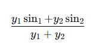

# 极值寻优控制（ESC）

------

## 一、算法名称

**极值寻优控制（Extremum Seeking Control, ESC）**

------

## 二、它解决什么问题？

### 适用场景

- 不知道目标值是多少
- 只知道某个物理量在某个点“最好”
- 最优点随温度 / 器件差异变化
- 系统是黑盒（无法建立精确数学模型）

### 光模块中的典型应用

- MZM Bias 控制
- EML 偏置控制
- TEC 微调
- TOPS 功率优化
- LPO 偏置自校准

------

## 三、核心思想

> 不知道最优点在哪，就轻轻晃一晃，看往哪边更好。

基本流程：

1. 在当前控制量上叠加一个小扰动（sin 波）
2. 观察输出变化
3. 判断趋势（向上更好还是向下更好）
4. 微调中心点
5. 重复循环

本质：

- 在线“找坡度方向”
- 不是基于误差
- 不需要目标值

------

## 四、与 PID 的本质区别

| 项目           | PID      | 极值寻优 |
| -------------- | -------- | -------- |
| 是否需要目标值 | 需要     | 不需要   |
| 是否计算误差   | 是       | 否       |
| 作用           | 跟踪     | 找最优点 |
| 控制依据       | 误差     | 趋势     |
| 适用场景       | 已知目标 | 目标未知 |

一句话总结：

> PID 是“追目标”，
> ESC 是“找最低点”。

------

## 五、代码结构对应关系

两状态循环结构：

```
SET_TOPS_STATE
↓
CAL_NEW_TOPS_STATE
↓
SET_TOPS_STATE
```

对应逻辑：

| 状态     | 作用                 |
| -------- | -------------------- |
| SET      | 输出带扰动的控制量   |
| CAL      | 采样、同步检波、累计 |
| 满足次数 | 更新中心点           |

------

## 六、核心直觉模型（山坡模型）

假设你站在山坡上：

- 不知道最低点在哪
- 往左试一点
- 往右试一点
- 看哪边更低
- 朝那边走一步

这就是算法在做的事情。

------

## 七、示例代码

归一化公式：消除y的影响，让算法在不同工作点下行为一致。

```python
import numpy as np
import matplotlib.pyplot as plt

# ============================================================
# 极简 ESC（极值寻优）模拟：你只需要改这里的参数就能“调参”
# ============================================================
A_DITHER = 0.25  # 扰动幅度（越大越“晃”，但更抗噪）
GAIN = 0.40  # 更新步长（越大越快，但更容易震荡/跑飞）
N_UPDATE = 40  # 累计多少点更新一次（越大越稳，但更慢）
N_PER_CYCLE = 40  # 每个正弦周期的离散点数（决定扰动频率）
STEPS = 2000  # 总步数
NOISE_STD = 0.02  # 测量噪声（模拟 ADC 噪声/环境扰动）
U0 = 4.5  # 初始点（离最优点越远越能看出“爬坡”过程）
SEED = 0  # 随机种子，方便复现


# ============================================================
# 被优化的“黑盒指标” y = f(u)（你可以把它换成任何函数）
# 这里用一个“碗形”函数，最低点在 u*=2.0
# ============================================================
def objective(u: float) -> float:
    u_star = 2.0
    return (u - u_star) ** 2 + 0.08 * np.sin(3.0 * u)  # 加一点非线性更像真实系统


rng = np.random.default_rng(SEED)

# 状态量
u = float(U0)  # 当前中心点（要被优化的变量）
phase = 0  # 正弦相位计数
acc_demod = 0.0  # ∑ y * sin(phase)  （同步检波相关项）
acc_total = 0.0  # ∑ y              （归一化用）
acc_n = 0  # 累计样本数

for k in range(STEPS):
    # 1) 生成扰动（dither）
    s = np.sin(2.0 * np.pi * (phase / N_PER_CYCLE))
    u_dithered = u + A_DITHER * s

    # 2) 采样输出（带噪声）
    y = objective(u_dithered) + rng.normal(0.0, NOISE_STD)

    # 3) 累计同步检波项（相关项）
    acc_demod += y * s  # 最终会得到一个方向(正/负)
    acc_total += y
    acc_n += 1

    # 4) 每 N_UPDATE 点更新一次中心点 u
    if acc_n >= N_UPDATE:
        if acc_total != 0.0:
            # 对“最小化 y”的问题：加一个负号，让它朝降低 y 的方向走
            u += -GAIN * (acc_demod / acc_total)   

        acc_demod = 0.0
        acc_total = 0.0
        acc_n = 0

    # 相位推进（控制扰动频率）
    phase += 1
    if phase >= N_PER_CYCLE:
        phase = 0
```


------

## 八、为什么在功率域 (mW) 工作？

原因：

DAC code 与物理功率之间通常是非线性关系（例如平方关系）。

如果在 DAC 域扰动：

- 实际功率变化不均匀
- 控制不稳定

在功率域：

- 扰动具有物理意义
- 控制一致性更好
- 限幅更直观

------

## 九、优点

- 不需要精确模型
- 自动适应温度变化
- 可长期在线运行
- 实现简单

------

## 十、缺点

- 系统始终存在小扰动
- 收敛速度有限
- 参数敏感，需要调试
- 噪声大时容易误判方向

------

## 十一、参数调节优先级建议

### 想更稳（减少抖动）

1. 减小 A_DITHER
2. 增大 N_UPDATE
3. 减小 GAIN

------

### 想更快收敛

1. 增大 GAIN
2. 减小 N_UPDATE
3. 在保证稳定前提下微调 A_DITHER

------

## 十二、核心总结

> 极值寻优控制是一种通过小扰动 + 趋势判断，
> 在线自动寻找最优工作点的算法。

它不是 PID， 不需要目标值，解决的是“最佳点未知”的问题。