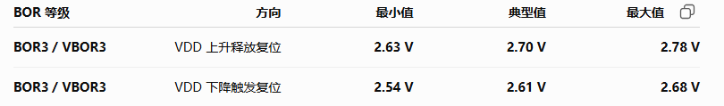

# 1. [STM32] [PWR] PVD检测功能

# 问题现象

现象：MCU使用的BOR等级为3。当MCU供电电压为2.8V时，MCU没有复位，但是此时DSP已经掉电，不符合光模块工作状态。**(MCU能正常工作，理论上光模块应该也是处于正常工作状态)**


# 修复方案

使用STM的PWR Monitor功能(PVD)，可编程电压检测器 (PVD)会监测 VDD 电源并将其与 VPVD 阈值进行比较，然后触发PWR中断我们可以在PWR中断中将MCU复位，从而把光模块的工作状态纠正回来。

```
The lowest BOR level is 1.71 V at power on, and other higher thresholds can be selected through option bytes.The devices feature an embedded programmable voltage detector (PVD) that monitors the VDD power supply and compares it to the VPVD threshold. 
```

# 经验总结

**问题本质：**

光模块的工作状态与实际元器件的工作状态对应不上。

**暴露的问题：**

1. 要将光模块作为一个整体来看待，所有元器件的工作状态要与模块统一。
