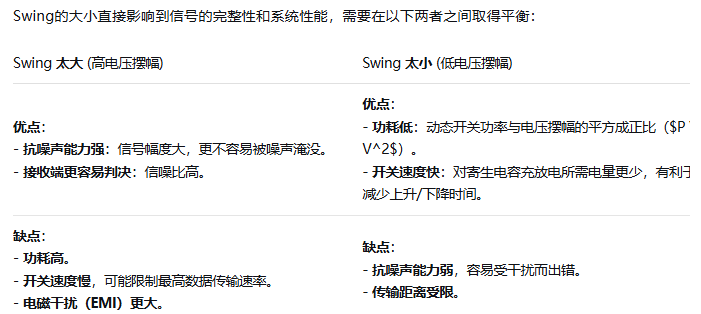

# 一、Swing（电压摆幅）

数字信号在**高电平（如‘1’）和低电平（如‘0’）** 之间切换时，电压变化的幅度。



# 二、Gray code

在PAM4调制中，格雷编码是一种**映射规则**。它把二进制比特组合映射到特定的电压电平上，但遵循一个原则：**相邻的电平之间，只相差1个比特**。

- ```
  - 非格雷编码（自然编码）：
    - 电平1（00） <—— 噪声干扰 ——> 电平2（01）：错了1个比特。
    - 电平2（01） <—— 噪声干扰 ——> 电平3（10）：错了2个比特（01变成10，两位都错）。
    - 电平3（10） <—— 噪声干扰 ——> 电平4（11）：错了1个比特。
  - 格雷编码：
    - 电平1（00） <——> 电平2（01）：错了1个比特。
    - 电平2（01） <——> 电平3（11）：错了1个比特（因为相邻的只变1位）。
    - 电平3（11） <——> 电平4（10）：错了1个比特。
  ```

在真实的物理信道中，噪声引起的误码最容易发生在**相邻电平**之间。如果使用格雷编码，即便发生了误码，也**只会导致1个比特出错**。而在自然编码下，相邻电平的误码可能会直接导致2个比特都出错（如01→10）。

- **发送时**：如果你想发送的二进制数据是 **11**，那么根据上述映射表，它会被映射到 **电平2**（即第二高的电压）发送出去。也就是说，11对应的是电平2。
- **接收时**：接收端采样到这个电平2，根据映射表进行判决，它会查询“哪个比特组合对应电平2？”。查表发现是11。所以，接收端会正确地将它解释为 **比特流 11**。

**总结**：所以只需要在发送端（HTX/LTX）使用格雷编码。它确保信号在到达接收端并可能被误判时，损失尽可能小。

# **三、Alignment Marker(对齐标记)**

**Alignment Marker 是 PCS 层周期性插入到每条 PCS lane 里的特殊标记。**接收端用它来做三件事：

```
1. 识别每条 PCS lane 是哪一条
2. 判断多条 lane 之间的延迟差，也就是 skew
3. 把多条 lane 重新对齐、重排序，恢复成原始高速数据流
```

------

### 1. 为什么需要 Alignment Marker？

高速以太网不是简单一根线传完整数据。比如 400G、800G 常常会把数据拆成多条 lane 传输：

```
原始数据流
   ↓
PCS 分发到多条 PCS lane
   ↓
PMA / DSP / 光电链路传输
   ↓
接收端再把多条 lane 拼回来
```

问题是：每条 lane 的物理路径、DSP 处理延迟、SerDes 延迟可能不完全一样，所以到达接收端的时间会有差异。

例如：

```
发送端同时发出：

Lane0: A0 A1 A2 A3 ...
Lane1: B0 B1 B2 B3 ...
Lane2: C0 C1 C2 C3 ...
Lane3: D0 D1 D2 D3 ...

接收端可能变成：

Lane0: A0 A1 A2 A3 ...
Lane1:       B0 B1 B2 B3 ...
Lane2:    C0 C1 C2 C3 ...
Lane3:          D0 D1 D2 D3 ...
```

这就叫 **lane skew**。

接收端如果不知道每条 lane 晚了多少，就没法正确把数据拼回去。
 **Alignment Marker 就是用来让接收端找到这些 lane 的位置差。**

Ethernet Alliance 对 200G/400G PCS 的说明里也提到，每条 PCS lane 都有唯一的 alignment marker，并周期性插入到码流中；接收端可以用这些 marker 做 lane 对齐。

### 2. Alignment Marker 长什么样？

你可以先不用关心具体 bit pattern，只要理解它有两个特征：

```
1. 它是已知模式
   接收端知道应该搜索什么内容

2. 每条 PCS lane 的 marker 不完全一样
   接收端能知道“这条数据原来属于 Lane 几”
```

所以它有点像高速公路上的路标：

```
“这里是 Lane0 的标记”
“这里是 Lane1 的标记”
“这里是 Lane2 的标记”
“这里是 Lane3 的标记”
```

接收端看到这些标记后，就可以判断：

```
Lane0 提前到
Lane1 晚了 3 个 block
Lane2 晚了 1 个 block
Lane3 晚了 5 个 block
```

然后用 FIFO / deskew buffer 把它们重新对齐。

